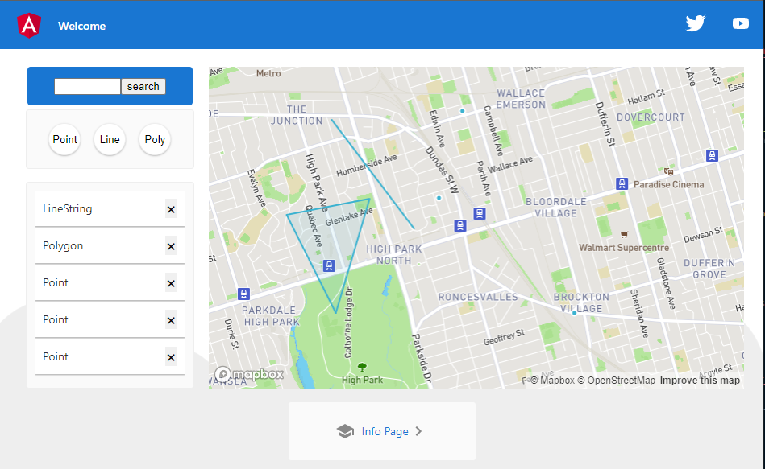

# MobileyeAssignment
Single Page application displaying map and annotations   
You can place shapes on the map and manage them  
##
This project was generated with [Angular CLI](https://github.com/angular/angular-cli) version 14.0.1.

## Tech stack
- [angular](https://angular.io)
- [ngrx](https://ngrx.io/)
- [mapbox](https://www.mapbox.com/)

# Develop
## Prerequisites
- you should have node 14 or later installed on your machine
## How To Run
- Open terminal
- Run `git clone https://github.com/shootermv/mobileyeAssignment.git`
- `cd mobileyeAssignment`
- Open `environment/environment.ts` file and replace `YOUR-MAPBOX-KEY` with real key
```js
export const environment = {
  production: false,
  accessKey: 'YOUR-MAPBOX-KEY'
};
```
- Run `ng  serve --open` for a dev server. Navigate to `http://localhost:4200/`. The application will automatically reload if you change any of the source files.

